BARUG - Benford's Law
========================================================
author: Dan Murphy
date: 10/4/2016
autosize: true

Sara Silverstein's post
========================================================
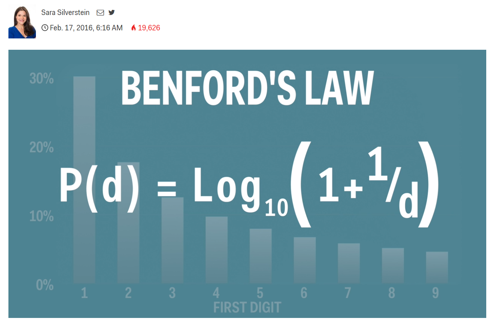

Tonight's agenda
========================================================

Reproduce Sara's post in R

- Graph Benford's Law

  - Ulterior motive: compare base graphics with ggplot2
  
- Do random calculations obey the law?

- Does insurance industry data obey the law?

  - Ulterior motive: process pdf files

Define the law and graph it
========================================================

Using base R


```r
BenfordsLaw <- function(d) log10(1 + 1 / d)
digits <- 1:9
baseBarplot <- barplot(BenfordsLaw(digits), 
    names.arg = digits, 
    xlab = "First Digit", ylim = c(0, .4),
    main = "Proportion of numbers with given First Digit")
```

base R plot
=====================================

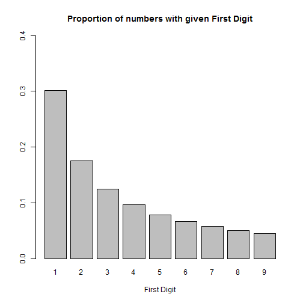

Using ggplot2 
========================================================


```r
library(ggplot2)

df <- data.frame(x = factor(digits), 
                 y = BenfordsLaw(digits))

ggBarplot <- ggplot(df, aes(x=x, y=y)) + 
  geom_bar(stat = "identity") +
  xlab("First Digit")+ylab(NULL)+ylim(0, .4) +
  ggtitle("Proportion of numbers with given First Digit")

print(ggBarplot)
```

ggplot2 plot
=========================================

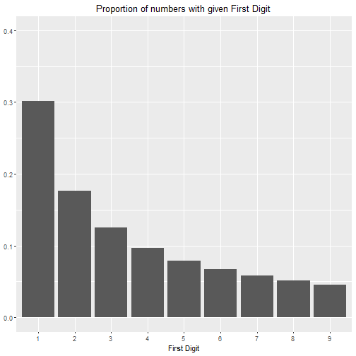

Both plots
========================================================

base R


***
ggplot2


Tabulate first-digit frequency of data
====================================

The first digit w/o leading zeros:

* firstDigit <- function(x) substr(gsub('[0.]', '', x), 1, 1)

Frequency of the first digit:

* pctFirstDigit <- function(x) table(firstDigit(x)) / length(x)


For example

```r
round(pctFirstDigit(seq(10, 90, by=10)), 2)
```

```

   1    2    3    4    5    6    7    8    9 
0.11 0.11 0.11 0.11 0.11 0.11 0.11 0.11 0.11 
```

Random calculations
====================================

1000 random numbers from 0 to 100


```r
N <- 1000
set.seed(1234)
x1 <- runif(N, 0, 100)
pf1 <- pctFirstDigit(x1)
round(pf1, 2)
```

```

   1    2    3    4    5    6    7    8    9 
0.11 0.11 0.12 0.10 0.12 0.11 0.10 0.10 0.13 
```

Plot actual versus expected
====================================

Base R: 'lines' adds to the previous (base) plot


```r
lines(x = baseBarplot[,1], y = pf1, col = "red", 
      lwd=4, type="b", pch=23, cex=1.5, bg="red")
```

ggplot2: use "layers" to add lines and points to a previous plot


```r
p1 <- ggBarplot + 
  geom_line(data = data.frame(pf1), 
            aes(x = Var1, y = Freq, group = 1), 
            colour = "red", size = 2) +
  geom_point(data = data.frame(pf1), 
             aes(x = Var1, y = Freq), 
             colour = "red", 
             size = 4, pch = 23, bg = "red")
print(p1)
```

Plot the actual versus expected
====================================

base R

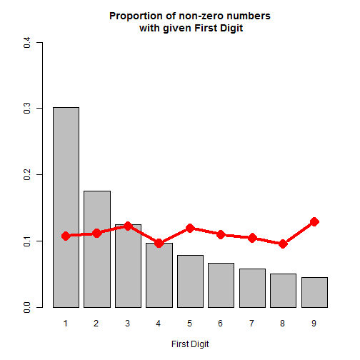

***

ggplot2

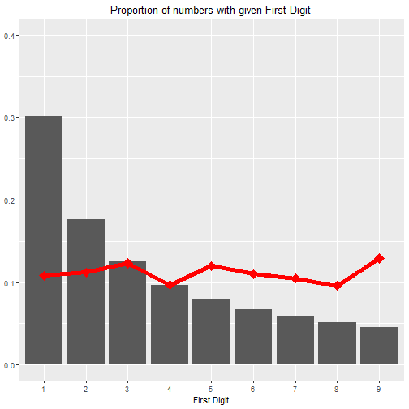

Square the numbers and plot
====================================

base R


```r
pf2 <- pctFirstDigit(x1^2)
lines(x = baseBarplot[,1], y=pf2, col="violet",
  lwd=4, type="b", pch=23, cex=1.5, bg="violet")
```

ggplot2


```r
p2 <- p1 +
  geom_line(data = data.frame(pf2), 
            aes(x = Var1, y = Freq, group = 1), 
            colour = "violet", size = 2) +
  geom_point(data = data.frame(pf2), 
             aes(x = Var1, y = Freq), 
             colour = "violet", 
             size = 4, pch = 23, bg = "violet")
print(p2)
```

Square the numbers and plot
====================================

base R

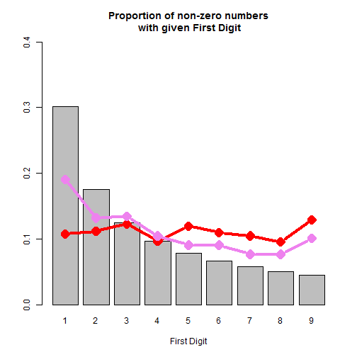

***

ggplot2

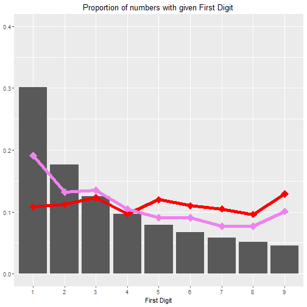

Divide by new random numbers
====================================


Base R

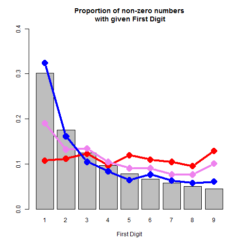

***

ggplot2

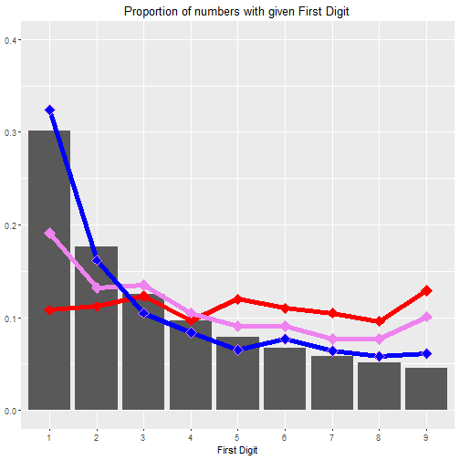

Finally, multiply by new random numbers
====================================

Base R

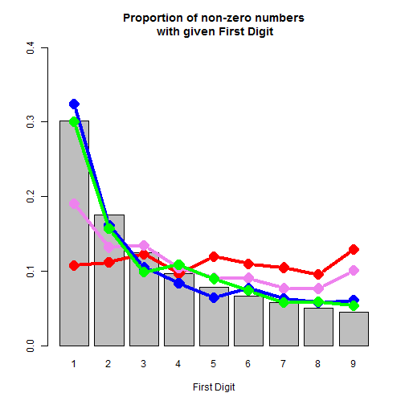

***

ggplot2

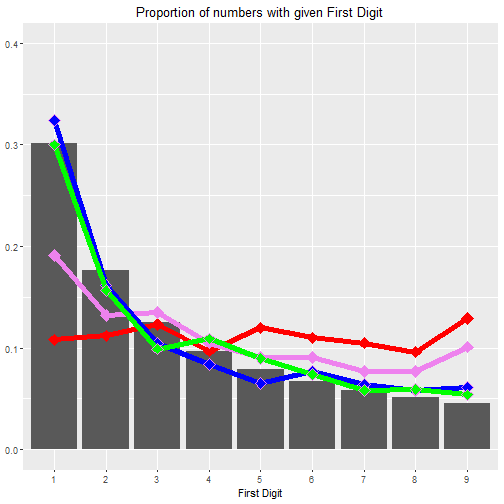

Manually adding layers is inefficient and inelegant

Better: put all data into one data.frame
===============================

Two steps:

1) Concatenate results of all 4 operations


```r
DF <- data.frame(cbind(digits,pf1,pf2,pf3,pf4))
names(DF) <- c("FirstDigit", "X1", "X1^2", "X1^2 / X3", "X1^2 / X3 * X4")
head(DF)
```

```
  FirstDigit    X1  X1^2 X1^2 / X3 X1^2 / X3 * X4
1          1 0.108 0.191     0.324          0.300
2          2 0.112 0.132     0.162          0.157
3          3 0.123 0.135     0.105          0.099
4          4 0.097 0.105     0.084          0.109
5          5 0.120 0.091     0.065          0.090
6          6 0.110 0.091     0.077          0.074
```

One data.frame (cont.)
===============================

2) Melt the data.frame so there is one observation per digit and operation


```r
library(reshape2)
meltedDF <- melt(DF, id = "FirstDigit", 
                 variable.name = "operation", 
                 value.name = "Freq")
head(meltedDF)
```

```
  FirstDigit operation  Freq
1          1        X1 0.108
2          2        X1 0.112
3          3        X1 0.123
4          4        X1 0.097
5          5        X1 0.120
6          6        X1 0.110
```

Now plot that data
============================

* The new variable "operation" distinguishes each digit's data
  * colour = operation gives data from like operations the same color
  * group = operation for geom_line will "connect the dots" of like operations
* ggplot builds a legend automatically


```r
P <- ggBarplot + 
  geom_line(data = meltedDF, 
    aes(x = FirstDigit, y = Freq,
        colour = operation, group = operation)) +
  geom_point(data = meltedDF, 
    aes(x = FirstDigit, y = Freq, 
        colour = operation, 
        bg = operation))
```

The plot 
=============================

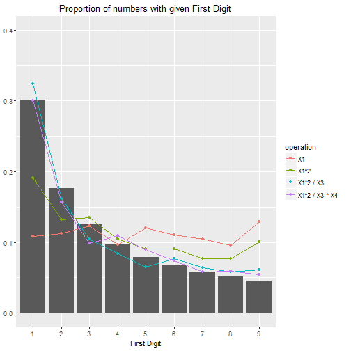

***

Wife unimpressed

Insurance industry data
==========================

* Read pdf file contents

* Identify all individual "words"

* Select only words that represent numbers

* Remove NA's and zeros, turn negatives into positives

* Tabulate and plot First Digit frequencies

Data analyzed
============================
* A one-page actuarial exhibit
* An insurance company rate filing
* An insurance company annual statement ("yellow book")
* Schedule P data for all U.S. property casualty insurers 1988 – 1997 

***


Reading pdf files - code
=========================


```r
library(tm)    # for readPDF
library(readr) # for parse_number
txt <- readPDF(control = list(text="-layout")
               )(elem = list(uri="exhibits.pdf"), 
                 language="en")$content
words <- scan(text=txt, what = "")
nmbrs <- suppressWarnings(sapply(
  words, parse_number))
nmbrs <- nmbrs[!is.na(nmbrs)]
# remove zeros, +- not shown
pf1 <- pctFirstDigit(nmbrs)
lines(x = baseBarplot[,1], y = pf1, col = "red", 
      lwd=4, type="b", pch=23, cex=1.5, bg="red")
```

Final plot
====================

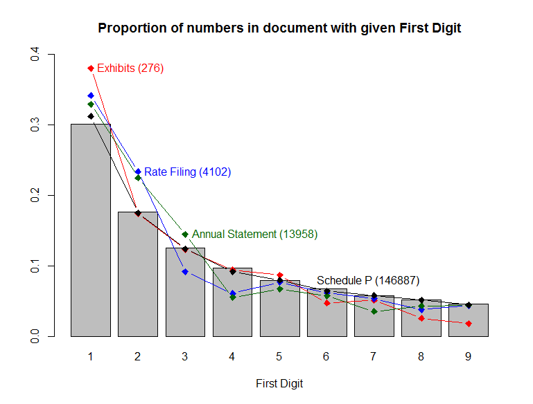

Questions
=====================

Name the future Laker

Any forensic accountants in the room?

***


Thank you
====================

Thanks for your attention.

For more information,
see my Benford posts at www.triKnowBits.com

Dan Murphy  
dmurphy@trinostics.com  
SCU '77

